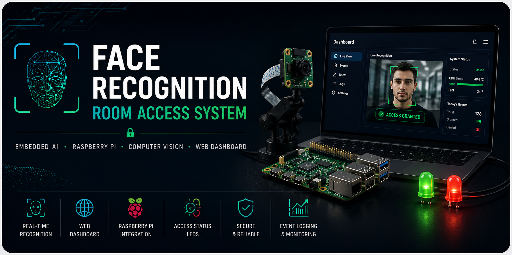
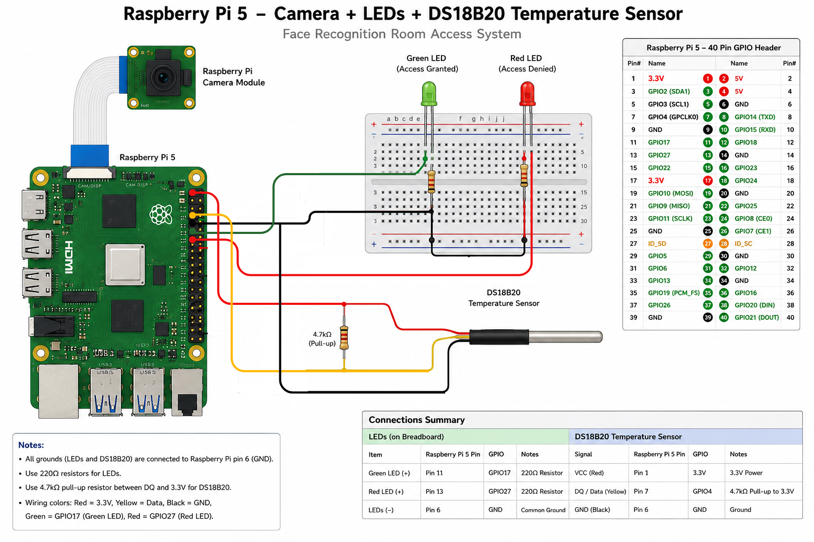

# Embedded AI Face Recognition Room Access System

<p align="center">
  
</p>

<p align="center">


</p>

---

## Project Overview

The **Face Recognition Room Access System** is a modular embedded AI application that combines computer vision, embedded hardware, and modern software engineering into a smart access control system.

The application captures live video from either a laptop webcam or a Raspberry Pi Camera, performs real-time face recognition using **InsightFace** and **ONNX Runtime**, evaluates access permissions, logs recognition events, controls external hardware, and provides both desktop and browser-based monitoring interfaces.

The project was designed with portability and maintainability in mind. The same application logic runs on both Windows and Raspberry Pi through configurable hardware abstraction layers and factory-based architecture.

This repository demonstrates practical experience in computer vision, embedded AI, Raspberry Pi development, Flask web applications, and modular software architecture.

---

## Features

- Real-time face recognition using InsightFace
- Laptop Webcam and Raspberry Pi Camera support
- Desktop OpenCV application
- Browser-based monitoring dashboard
- Browser-based user enrollment
- Automatic embedding generation
- GPIO controlled status LEDs
- Temperature sensor integration
- Automatic event logging
- Cross-platform deployment (Windows & Raspberry Pi)
- JSON configuration profiles
- Modular object-oriented architecture

---

## Technology Stack

| Category | Technology |
|------------|------------|
| Language | Python |
| Computer Vision | OpenCV |
| Face Recognition | InsightFace |
| AI Inference | ONNX Runtime |
| Web Framework | Flask |
| Embedded Platform | Raspberry Pi 5 |
| Hardware | Raspberry Pi Camera, GPIO LEDs, DS18B20 Temperature Sensor |
| Configuration | JSON |
| Version Control | Git & GitHub |

---

## System Architecture

The application follows a modular architecture where camera handling, AI inference, hardware control, logging, configuration, and user interfaces are separated into independent components.

The same processing pipeline is shared between the desktop application and the web dashboard while hardware-specific implementations are selected automatically through factory classes.


---

## Hardware Setup

The Raspberry Pi version demonstrates how computer vision can interact with physical hardware.

Connected hardware includes:

- Raspberry Pi 5
- Raspberry Pi Camera
- Green Status LED
- Red Status LED
- Temperature Sensor (DS18B20)

<p align="center">



</p>


---

## Project Structure

```text
face-recognition-room-access-system

├── config/
├── data/
├── docs/
├── scripts/
├── src/
│   └── room_access/
│       ├── app/
│       ├── camera/
│       ├── config/
│       ├── dashboard/
│       ├── hardware/
│       ├── processing/
│       ├── recognition/
│       ├── static/
│       ├── storage/
│       └── templates/
│
├── tests/
│
├── main.py
└── README.md
```

---

## Installation

### Windows

```bash
git clone https://github.com/AbbasMahdiyeh/face-recognition-room-access-system.git

cd face-recognition-room-access-system

python -m venv .venv

.venv\Scripts\activate

pip install -r requirements.txt
```

---

### Raspberry Pi

```bash
git clone https://github.com/AbbasMahdiyeh/face-recognition-room-access-system.git

cd face-recognition-room-access-system

python3 -m venv .venv

source .venv/bin/activate

pip install -r requirements-raspberrypi.txt
```

---

## Usage

### Desktop Application

```bash
python main.py live
```

Starts the OpenCV desktop application with real-time face recognition.

---

### Web Dashboard

```bash
python main.py web
```

Starts the Flask web server.

After launching the application, open your browser and navigate to:

```text
http://<raspberry-pi-ip>:5000
```

Example:

```text
http://192.168.1.25:5000
```

---

### User Enrollment

```bash
python main.py enroll
```

Registers new users and generates facial embeddings automatically.

---


### User Enrollment (Web Dashboard)

Start the Web Dashboard:

```bash
python main.py web
```

Then open:

```text
http://<raspberry-pi-ip>:5000/enroll
```

Example:

```text
http://192.168.1.25:5000/enroll
```

The browser-based enrollment interface captures multiple reference images and automatically generates the user's facial embedding.

---

## Future Improvements

- Face Anti-Spoofing
- Multi-camera Support
- Door Relay Integration
- RFID Authentication
- User Roles & Permissions
- SQLite / PostgreSQL Support
- REST API
- Docker Deployment
- Mobile Dashboard
- Web-based User Management

---

## License

This project is released under the MIT License.

---

Developed as part of a personal portfolio project to explore Embedded AI, Computer Vision, Raspberry Pi, and modern software architecture.